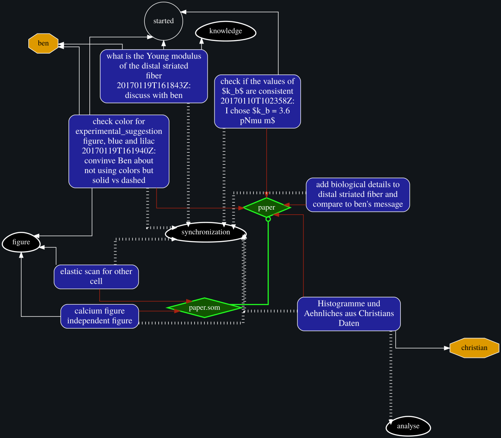

# task2dot

This program helps with the creation of visualizations of todo
lists. It works as a simple filter between [taskwarrior](https://github.com/GothenburgBitFactory/taskwarrior) and [graphviz](http://www.graphviz.org/).

The code is now on https://pypi.org and can be installed via

    python3 -m pip install task2dot

if you prefer to work with installed software, compared to interpreted source code.
Otherwise execution is performed via python3 task2dot/task2dot.py.

## general usage

At the command line write

    task export | task2dot | dot -Tsvg > test.svg

With this, all todo items that you have ever created are fed into
`task2dot`. Without any arguments, it just translates the export
into a format that is suitable for `graphviz` whose output is saved
in the file `test.svg`. We can expect this to result in an insanely
messy network graphics.

For clarity, I will not show the dot command and the output
redirection into a file in any the following code snipptes. Note
that those have to be added for obtaining useful commands.

When exporting data from `taskwarrior` one has to explicitely state
that one only wants to export pending tasks:

    task status:pendung export | task2dot

See a working example:

## what are the nodes, what are the edges

Every task in the taskwarrior export is a node in the dot
graph. The text in the task's nodes are its descriptions and all of
its annotations, except for the information of items being started
or stopped. Also projects and tags are nodes. The projects and the
tasks are connected and the tasks are connected with its tags. The
dependencies between tasks are shown as well.

User defined attributes are supported as well. If the task
configuration file is `~/.taskrc` or can be found in the environment
variable `$TASKRC` then all user defined attributes are shown as
nodes that are connected to its respective tasks. This usually is
overkill, which is why there are two mechanisms to exclude nodes
and connections from the graph.

## node and edge exclusion

### node exclusion

To exclude a specific node write

    task status:pending export | task2dot -node

Then there will be no node with the content 'node' in the output
graph.

So why is this useful? If you try to implement *Kanban* or something
similar you are very likely to have a certain tag or a user
defined attribute, like `todo` far too often for having it in a
graph visualization. Almost all tasks would be connected to it via
edges, which is useless. Also, if you export taskwarrior data,
which is filtered with a specific `tag` will cause the resulting
graph having a lot of connections to that tag. So the following
visualization would be useful:

    task status:pending +work | task2dot -work

### node type and edge exclusion

A specific type of node can be excluded by using two hyphens. For
example, not showing any project nodes looks like this:

    task status:pendung export | task2dot --project

Or not showing any tags:

    task status:pendung export | task2dot --tags

In my workflow, paths and emails ids are attached to tasks, so I
need to write

    task export | task2dot --path --email

It is also possible to exclude certain connections also by using
double hyphen. Let's get rid of all connections from tasks to
tags:

    task export | task2dot --task-tags

## more connections: overnext neighbors

It is possible to add additional edges than what taskwarrior
exports directly. One could for example add edges between projects
and tags because they are connected by tasks that have both. If one
then removes the tasks one can look at a graph that shows us which
'actions' are needed for certain projects, if the tags represent
'actions'. Similarly to edge exclusion, we use ++node1-node2 to add
additional edges.

    task export | task2dot ++tags-project --task